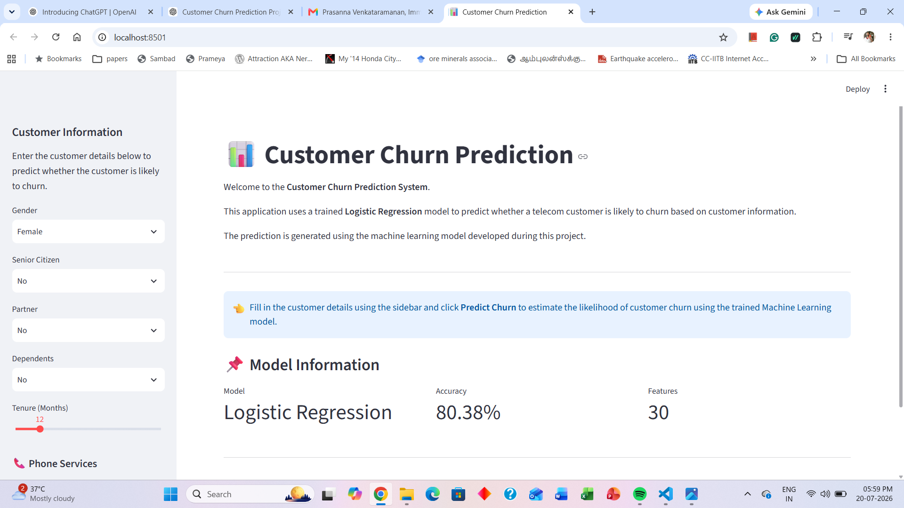
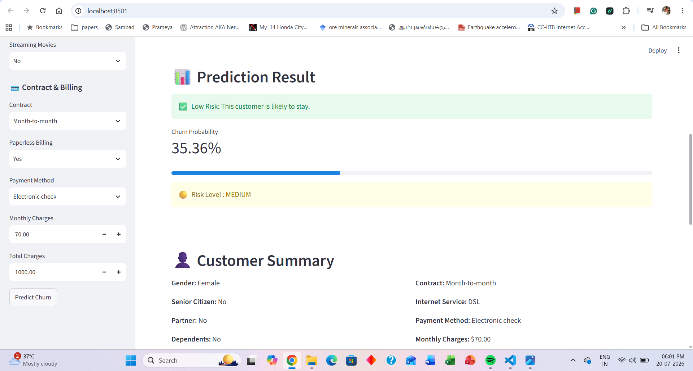
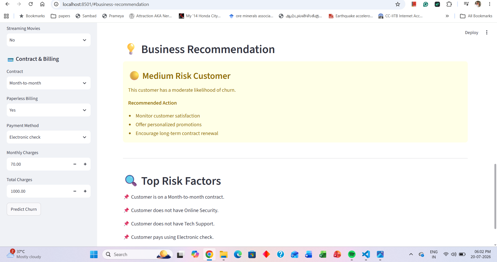
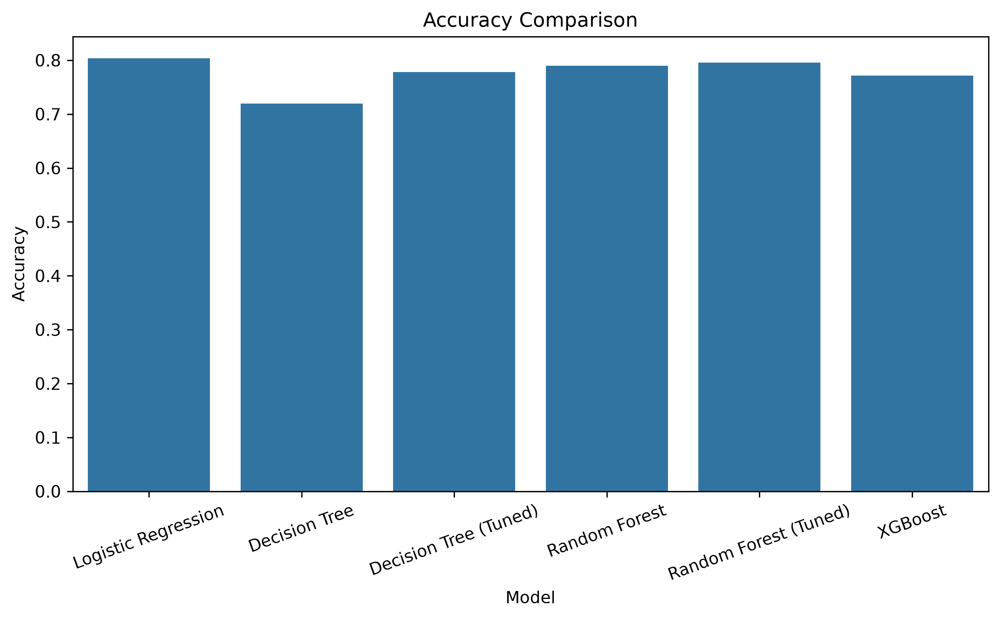
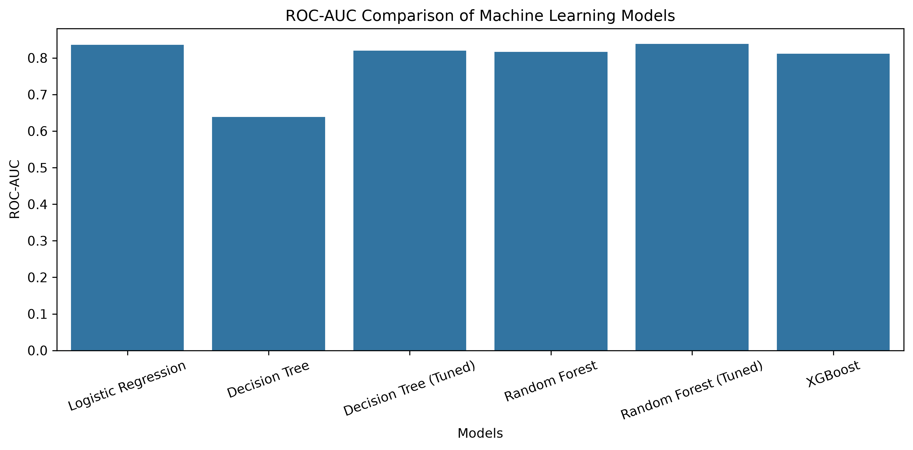
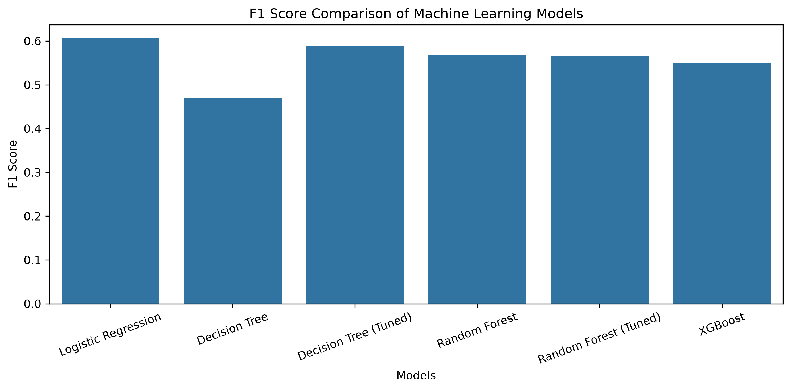
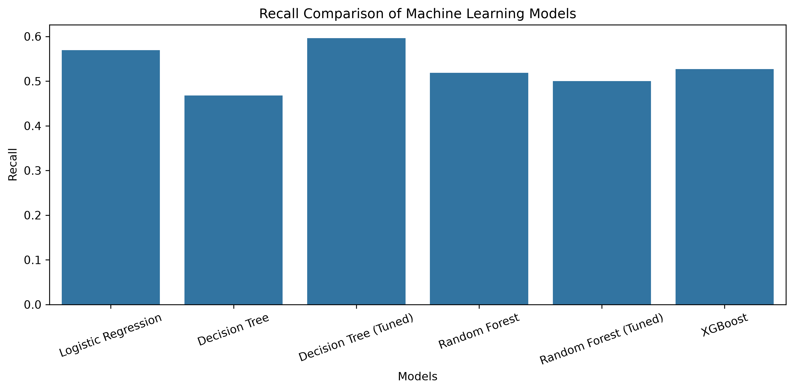

# 📊 Customer Churn Prediction using Machine Learning

An end-to-end Machine Learning project that predicts whether a telecom customer is likely to churn based on customer demographics, account information, and subscribed services.

The project includes the complete machine learning workflow, from data preprocessing and exploratory data analysis (EDA) to model development, evaluation, and deployment using Streamlit.

---

## 🚀 Project Overview

Customer churn is one of the biggest challenges faced by telecom companies. Retaining existing customers is often more cost-effective than acquiring new ones.

This project predicts the probability of customer churn using historical customer data and provides business recommendations based on the prediction.

---

## 🚀 Live Demo

🔗 **Try the application here:**

https://customer-churn-prediction-e8phepz3cffx49rmdb7a9w.streamlit.app

---

## 🎯 Business Problem

The objective is to build a classification model capable of predicting whether a customer is likely to leave the telecom company.

Early prediction enables businesses to:

- Improve customer retention
- Reduce revenue loss
- Identify high-risk customers
- Design targeted retention strategies

---

## 📂 Dataset

**Dataset:** IBM Telco Customer Churn Dataset

The dataset contains customer information including:

- Customer demographics
- Internet services
- Phone services
- Billing information
- Contract details
- Customer tenure
- Churn status

---

## ⚙️ Project Workflow

1. Data Understanding
2. Data Cleaning
3. Exploratory Data Analysis (EDA)
4. Feature Engineering
5. Data Preprocessing
6. Model Building
7. Model Evaluation
8. Model Comparison
9. Model Deployment using Streamlit

---

## 📁 Project Structure

```text
customer_churn_prediction/
│
├── app/
│   ├── app.py
│   └── prediction.py
│
├── data/
│   ├── raw/
│   └── processed/
│
├── images/
│
├── models/
│
├── notebooks/
│
├── results/
│
├── README.md
├── requirements.txt
└── .gitignore
```

---

## 🤖 Machine Learning Models

The following classification models were developed and evaluated:

- Logistic Regression
- Decision Tree
- Random Forest
- XGBoost

The best-performing model was deployed using Streamlit for real-time predictions.

---

## 📈 Model Performance

Six machine learning models were trained and evaluated using Accuracy, Precision, Recall, F1 Score, and AUC.

| Model | Accuracy | Precision | Recall | F1 Score | AUC |
|-------|---------:|----------:|--------:|---------:|--------:|
| **Logistic Regression** | **80.38%** | **64.94%** | **56.95%** | **60.68%** | **83.60%** |
| Decision Tree (Tuned) | 77.83% | 58.07% | 59.63% | 58.84% | 81.97% |
| Random Forest (Tuned) | 79.53% | 64.93% | 50.00% | 56.50% | 83.85% |
| Random Forest | 78.96% | 62.58% | 51.87% | 56.73% | 81.63% |
| XGBoost | 77.11% | 57.60% | 52.67% | 55.03% | 81.14% |
| Decision Tree | 71.93% | 47.17% | 46.79% | 46.98% | 63.88% |

**Final Model Selected:** Logistic Regression

**Reason for Selection:**
- Highest **F1 Score (60.68%)**, providing the best balance between Precision and Recall.
- Strong **AUC (83.60%)**, indicating excellent discrimination between churn and non-churn customers.
- Simple, interpretable, and computationally efficient for deployment in the Streamlit application.


## 🌐 Streamlit Web Application

The web application allows users to:

- Enter customer details
- Predict customer churn
- View churn probability
- View customer risk level
- View business recommendations
- Identify top churn risk factors

---

# 📸 Application Screenshots

## Home Page



---

## Customer Summary



---

## Business Recommendation



---

## Model Comparison

### Accuracy Comparison



### AUC Comparison



### F1 Score Comparison



### Recall Comparison



---

## 🛠 Technologies Used

- Python
- Pandas
- NumPy
- Scikit-learn
- XGBoost
- Matplotlib
- Seaborn
- Joblib
- Streamlit

---

## ▶️ Installation

Clone the repository

```bash
git clone https://github.com/PRASANNA2408/customer-churn-prediction.git
```

Navigate to the project

```bash
cd customer-churn-prediction
```

Install dependencies

```bash
pip install -r requirements.txt
```

Run the Streamlit application

```bash
streamlit run app/app.py
```

---

## 🔮 Future Improvements

- Hyperparameter optimization
- SHAP explainability
- Cloud deployment
- API integration
- Deep Learning model comparison

---

## 👨‍💻 Author

**Prasanna Venkataramanan**

If you found this project useful, feel free to ⭐ the repository.